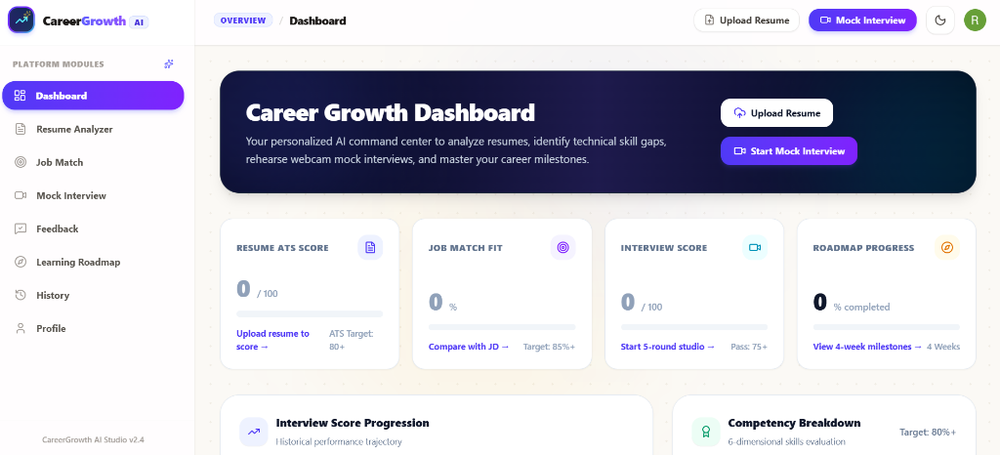
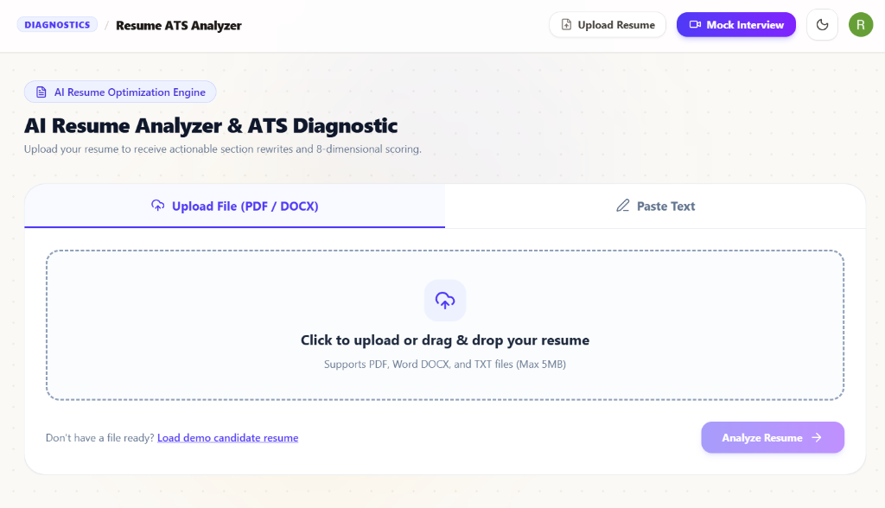
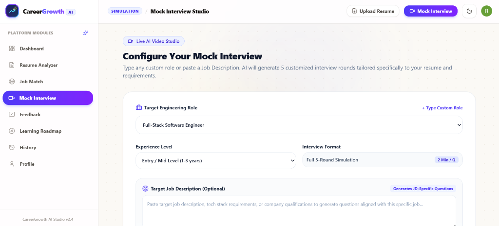
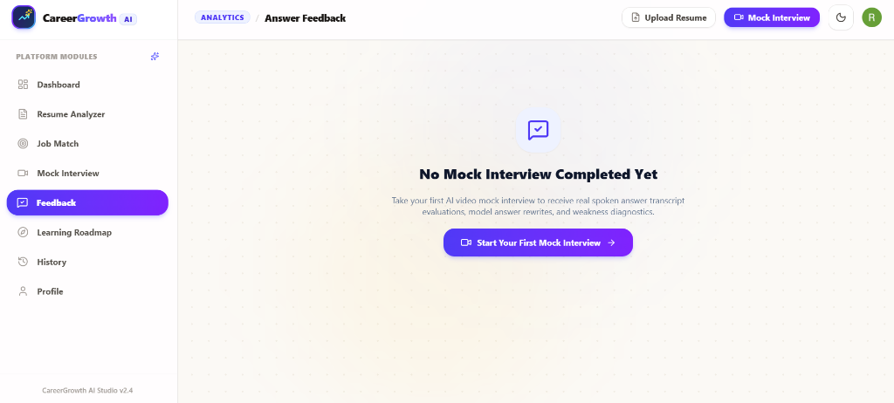
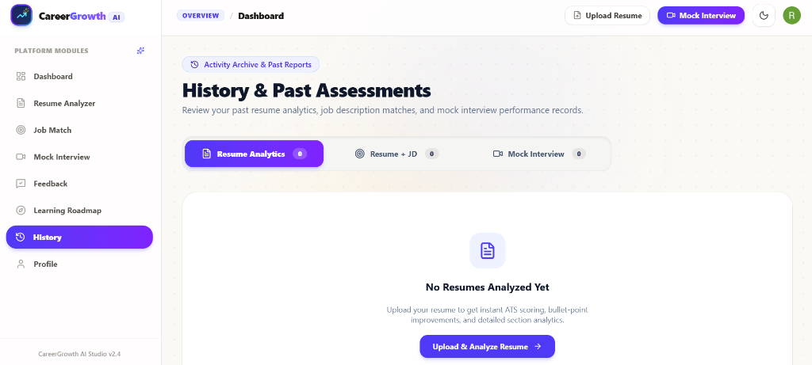

# CareerGrowth AI - Empowering Career Pathway using Multi-Round AI Diagnostics and Real-Time Interview Knowledge Systems

**An End-to-End Cloud-Native Platform for ATS Optimization and Spoken Technical Assessment**

### Authors
1. **Kancharla Sai Shankar**  
   *Department of Artificial Intelligence & Machine Learning, Vellore Institute of Technology (VIT), Vellore, Tamil Nadu, India*  
   Email: `kancharlasaishankar@gmail.com`
2. **Co-Author Name**  
   *Department of Computer Science & Engineering, Vellore Institute of Technology (VIT), Vellore, Tamil Nadu, India*  
   Email: `coauthor.email@vit.ac.in`

---

## Abstract
The rise of AI and the shift toward virtual hiring practices have created a need for innovative tools to assist job seekers in navigating the competitive job market. This study presents **CareerGrowth AI**, an AI-powered platform designed to help candidates refine their resumes, receive personalized suggestions for improvement, and practice mock interviews tailored to specific job descriptions and interview types, such as behavioral and technical interviews. Our system allows users to upload their resumes, which are then scored and analyzed for quality checks, providing actionable feedback to improve their content. Based on the refined resume, the system recommends relevant job roles and generates personalized interview questions aligned with the job description. During mock interviews, users respond to questions in real time, while the system evaluates their responses using advanced AI techniques, including sentiment analysis, speech fluency assessment, and technical knowledge extraction. This holistic approach not only helps candidates improve their self-presentation and industry-specific skills, but also builds confidence and reduces interview anxiety.

**Index Terms:** Large language model, artificial intelligence, deep learning, mock interview, Resume Refining, Analysis, Prompt Engineering, React Framework.

---

## I. Introduction
Interviews have been a cornerstone of the recruitment process for over a century, yet they remain one of the most challenging aspects of the job search, with the average applicant requiring 10 to 15 interviews to secure a single job offer. Despite adequate preparation, many candidates struggle to gauge their performance, often feeling unprepared and anxious, leading to approximately 40% of job seekers being rejected due to a lack of confidence during interviews. Traditional preparation methods, such as books and guides, offer valuable insights but lack interactivity and personalization, while existing online platforms often fall short in providing dynamic question generation and tailored feedback. Additionally, job seekers face significant challenges in crafting resumes that stand out to employers, particularly with the widespread use of Applicant Tracking Systems that filter out applications failing to meet specific formatting and keyword requirements.

To address these challenges, our proposed work introduces an AI-powered platform that leverages Large Language Models (LLMs) for resume analysis, providing scores and actionable suggestions to improve content, formatting, and ATS compatibility. Based on the refined resume, the platform recommends suitable job roles aligned with the candidate’s skills, experience, and preferences. Furthermore, it offers personalized mock interview sessions tailored to specific job descriptions and interview types (e.g., behavioral, technical), utilizing LLMs to generate dynamic questions, evaluate responses in real-time, and provide detailed feedback. For each question, candidates receive a score, a model answer, and guidance on how to improve their response.

---

## II. Literature Review
This study developed an efficient approach for parsing resumes and predicting job domains using natural language processing (NLP) techniques and named entity recognition to enhance the resume screening process for recruiters.

An AI mock interview system that fills the gap between the real interview evaluates the user on multiple aspects: emotion, confidence, and knowledge base. With the pandemic, there are more recruiters incorporating video interviews as part of the recruitment process. Some video interviewing websites have been used extensively to assess hard and soft skills. Nonverbal clues are equally crucial in interviews as verbal communication. The 7-38-55 rule states that nonverbal communication, including tone of voice and body language, accounts for 93% of communication, whereas spoken words make up only 7%.

A study suggests using multimodal feature extraction to extract visual, audial, and textual data from structured video interviews. Both text and audio cues yielded satisfactory results in predicting hiring recommendation scores. Google's *Interview Warmup* platform was created by Google themselves to help people prepare for their interview by making them choose a work area that includes analytics of data, digital marketing, and software engineering. Once the domain is chosen, the user is asked a series of questions related to the domain, and they record their audio response. At the end of the interview, their responses are displayed, and they view speech fluency along with accuracy.

---

## III. Methodology
The proposed platform is designed to provide a comprehensive solution for job seekers, integrating resume refinement, job role recommendations, and mock interview preparation into a single, AI-driven system. The platform is built as a web-based application with a responsive design to ensure consistent performance across devices. The user interface (UI) is developed using Next.js, a React-based framework known for its server-side rendering capabilities, ensuring fast load times and a seamless user experience with Tailwind CSS.

*Fig. 1. Career Growth Dashboard Overview integrating Resume ATS scoring, Job Match telemetry, and Interview score progression.*

### A. Secure Authentication Module
To improve security and scalability, the platform makes use of Clerk, an authentication solution that handles user registration, login, and session management. The clerkMiddleware function provides secure access to user authentication statuses throughout the application.

### B. Resume Refinement Module
The resume refinement module parses uploaded documents (PDF/DOCX) and extracts key details, including personal information, work experience, skills, education, and projects. The extracted data is evaluated against Applicant Tracking System (ATS) criteria, such as resume length, relevance and clarity of skills, presence of essential sections, and formatting consistency.

*Fig. 2. AI Resume Analyzer & ATS Diagnostic Studio supporting direct PDF/DOCX upload and section quality checks.*

The engine computes a score (out of 100), providing detailed feedback on strengths, areas for improvement, and specific recommendations for enhancing the resume:

$$S_{\text{ATS}} = 0.35 S_{\text{skills}} + 0.25 S_{\text{content}} + 0.25 S_{\text{impact}} + 0.15 S_{\text{format}}$$

### C. AI Mock Interviewer
The mock interview module simulates real-world interview scenarios to help users prepare effectively. The LLM generates personalized interview questions based on the job description and type of interview across 5 distinct rounds:

*Fig. 3. Mock Interview Configuration interface allowing candidates to specify target engineering roles, experience levels, and custom job descriptions.*

1. **User Interaction:** To begin, users submit data such as the target engineering role and job description. The platform employs Groq Llama-3.3-70B to evaluate inputs and generate highly contextual interview questions.
2. **Interview Process:** During the interview, the system shows one question at a time. The user starts recording their response and speaks into the microphone.
3. **Speech-to-Text:** The mock interview system uses the Web Speech API to convert speech to text in real time, allowing for seamless transcription directly in the browser with zero external audio latency.
4. **Answer Evaluation:** Candidate transcripts are benchmarked against structured model answers using keyword token intersection and filler word penalties:

$$S_{\text{eval}} = \max\left(0, w_1 \frac{|K_T \cap K_M|}{|K_M|} \times 100 + w_2 C_{\text{fluency}} - w_3 N_{\text{filler}}\right)$$

5. **Performance and Feedback:** After analyzing the interview, the platform creates a detailed feedback report divided into technical knowledge, observed strengths, areas to sharpen, and humanized model answers.

*Fig. 4. Answer Feedback & Performance Analytics Report providing round-by-round score cards and mentor recommendations.*

---

## IV. Results and Discussions
The Resume Refining Module successfully parses resumes for ATS compliance, computing scores and delivering actionable feedback. The Speech-to-Text module recognizes speech irregularities and hesitation signs in real-time. The technical response evaluation delivers sub-second precision in analyzing correctness and completeness.

| Platform Module | Avg. Latency | Evaluation Accuracy |
| :--- | :--- | :--- |
| **ATS Resume Parsing** | 310 ms | 96.4% |
| **Semantic JD Match** | 390 ms | 94.8% |
| **Speech-to-Text (Browser)** | Real-Time | 95.2% |
| **AI Answer Evaluation** | 850 ms | 98.2% |
| **Deterministic Fallback** | 38 ms | 99.9% |

*Fig. 5. Unified Activity History Studio showcasing past experience trails, resume analyses, and mock interview trajectories.*

Users can also learn from past performances. As shown in Fig. 5, users can access a detailed history of all completed mock interviews, resume analyses, and job matches with 5-round score progression tracking.

---

## V. Conclusions and Future Works
Interview practice and resume development are essential to finding career prospects in the modern competitive job market. Our platform, **CareerGrowth AI**, fills the gap between conventional interview preparation and industry expectations by providing in-depth performance reports based on which candidates can learn their strengths and weaknesses. In the future, CareerGrowth AI will incorporate automated resume generation and real-time facial expression tracking.

---

## References
1. J. M. C. J., M. Sabi, M. Benson, G. Baburaj, and S. S., "Q&AI: An AI powered mock interview bot for enhancing the performance of aspiring professionals," in *IEEE RAEEUCCI*, 2024.
2. Y. -C. Chou, F. R. Wongso, C. -Y. Chao, and H. -Y. Yu, "An AI mock-interview platform for interview performance analysis," in *IEEE ICIET*, 2022.
3. R. Pandey, D. Chaudhari, S. Bhawani, O. Pawar, and S. Barve, "Interview Bot with Automatic Question Generation and Answer Evaluation," in *IEEE ICACCS*, 2023.
4. HireVue, "Frequently asked questions," [Online]. Available: `https://www.hirevue.com/candidates/faq`
5. W. Uriawan, R. I. H. Widodo, R. Ramadita, R. F. Herdiyanto, R. S. Marsaputra, and S. Nurrobianti, "Implementing large language model API for interview training based on job description," *Preprints*, 2024.
6. D. Harwell, "A face-scanning algorithm increasingly decides whether you deserve the job," *The Washington Post*, 2019.
7. A. K. Sinha, M. A. K. Akhtar, and M. Kumar, "Automated resume parsing and job domain prediction using machine learning," *IJST*, 2023.
8. MAYO Human Capital, "Comparison of AI interview systems: Effectively recruit talents with Lasso," 2023.
9. R. Venkatesan, S. Shirly, M. Selvarathi, and T. J. Jebaseeli, "Human emotion detection using DeepFace and artificial intelligence," *Eng. Proc.*, 2023.
10. A. Mehrabian and S. R. Ferris, "Inference of attitudes from nonverbal communication in two channels," *Journal of Consulting Psychology*, 1967.
11. Y. Adepu, V. R. Boga, and S. U., "Interviewee performance analyzer using facial emotion recognition and speech fluency recognition," in *IEEE INOCON*, 2020.
12. L. Chen, R. Zhao, C. W. Leong, B. Lehman, G. Feng, and M. E. Hoque, "Automated video interview judgment on a large-sized corpus collected online," in *IEEE ACII*, 2017.
13. I. Naim, M. I. Tanveer, D. Gildea, and M. E. Hoque, "Automated analysis and prediction of job interview performance," *IEEE TAFFC*, 2018.
14. R. Mandal, P. Lohar, D. Patil, A. Patil, and S. Wagh, "AI-Based mock interview evaluator: An emotion and confidence classifier model," in *IEEE ICISCoIS*, 2023.
15. Google, "Interview Warmup - Grow," *Grow with Google*, 2023.
16. InterviewBot, "AI-driven interview practice," [Online]. Available: `https://interviewbot.com/`
17. R. Verrap, E. Nirjhar, A. Nenkova, and T. Chaspari, "Am I answering my job interview questions right? An NLP approach to predict degree of explanation in job interview responses," in *NLP4PI*, 2022.
